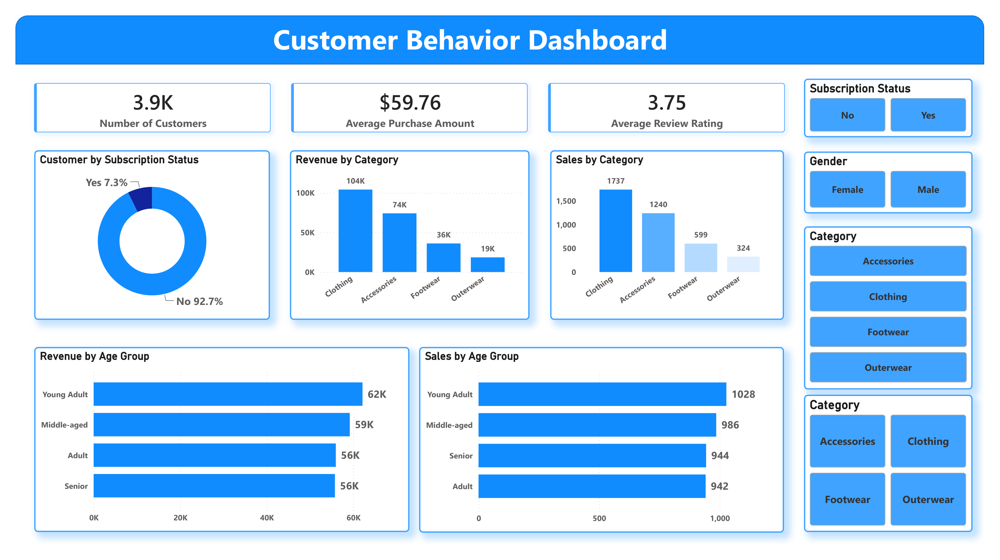

# 🛍️ Customer Shopping Behavior Analysis Dashboard

## 📌 Project Overview

This project analyzes customer shopping behavior using transactional data from **3,900 customer purchases** across multiple product categories. The objective is to uncover insights into customer spending patterns, purchasing preferences, subscription behavior, and demographic trends using **Python, PostgreSQL, and Power BI**. :contentReference[oaicite:0]{index=0}

The project follows a complete data analytics workflow:

- Data Cleaning & Preprocessing (Python)
- Exploratory Data Analysis (Python)
- Business Analysis (SQL/PostgreSQL)
- Interactive Dashboard Development (Power BI)
- Business Recommendations

---

## 📊 Dashboard Preview



---

## 🎯 Objectives

- Understand customer purchasing behavior.
- Analyze revenue contribution across customer segments.
- Identify top-performing products and categories.
- Evaluate subscription impact on sales.
- Examine age-group and gender-based purchasing trends.
- Support business decision-making through data-driven insights.

---

## 🗂️ Dataset Information

| Metric | Value |
|----------|---------|
| Total Records | 3,900 |
| Total Features | 18 |
| Missing Values | 37 (Review Rating) |
| Categories | Clothing, Accessories, Footwear, Outerwear |

### Key Features

#### Customer Information
- Customer ID
- Age
- Gender
- Location
- Subscription Status

#### Purchase Information
- Item Purchased
- Category
- Purchase Amount
- Season
- Size
- Color

#### Shopping Behavior
- Discount Applied
- Previous Purchases
- Purchase Frequency
- Review Rating
- Shipping Type

---

# 🐍 Data Cleaning & Preprocessing

### Data Preparation

- Imported dataset using Pandas.
- Performed exploratory analysis using:
  - `df.info()`
  - `df.describe()`
- Identified and handled missing values.
- Standardized column names using snake_case convention.
- Removed redundant columns.

### Missing Value Treatment

Missing values in the **Review Rating** column were imputed using the **median rating of each product category**. :contentReference[oaicite:1]{index=1}

### Feature Engineering

Created:

- `age_group`
- `purchase_frequency_days`

These features improved segmentation and reporting capabilities. :contentReference[oaicite:2]{index=2}

---

# 🗄️ SQL Business Analysis

The cleaned dataset was loaded into PostgreSQL for business-oriented analysis. :contentReference[oaicite:3]{index=3}

### Key Business Questions Answered

### 1. Revenue by Gender

| Gender | Revenue |
|----------|---------|
| Male | $157,890 |
| Female | $75,191 |

### 2. High-Spending Discount Users

Identified customers who used discounts while still spending above the average purchase amount.

### 3. Top Rated Products

| Product | Avg Rating |
|----------|------------|
| Gloves | 3.86 |
| Sandals | 3.84 |
| Boots | 3.82 |
| Hat | 3.80 |
| Skirt | 3.78 |

### 4. Shipping Type Analysis

| Shipping Type | Avg Purchase |
|--------------|--------------|
| Standard | $58.46 |
| Express | $60.48 |

### 5. Subscribers vs Non-Subscribers

| Status | Customers | Avg Spend | Revenue |
|----------|----------|-----------|---------|
| Yes | 1,053 | $59.49 | $62,645 |
| No | 2,847 | $59.87 | $170,436 |

### 6. Discount-Dependent Products

Products with the highest percentage of discounted purchases:

- Hat
- Sneakers
- Coat
- Sweater
- Pants

### 7. Customer Segmentation

| Segment | Customers |
|----------|----------|
| Loyal | 3,116 |
| Returning | 701 |
| New | 83 |

### 8. Top Products by Category

#### Accessories
- Jewelry
- Sunglasses
- Belt

#### Clothing
- Blouse
- Pants
- Shirt

#### Footwear
- Sandals
- Shoes
- Sneakers

#### Outerwear
- Jacket
- Coat

### 9. Repeat Buyers & Subscription Analysis

Evaluated whether repeat customers (>5 purchases) are more likely to subscribe.

### 10. Revenue by Age Group

| Age Group | Revenue |
|------------|---------|
| Young Adult | $62K |
| Middle-aged | $59K |
| Adult | $56K |
| Senior | $56K |

---

# 📈 Power BI Dashboard Features

The dashboard provides interactive insights into customer behavior through:

### KPI Cards
- Total Customers
- Average Purchase Amount
- Average Review Rating

### Visualizations
- Subscription Status Distribution
- Revenue by Category
- Sales by Category
- Revenue by Age Group
- Sales by Age Group

### Interactive Filters
- Subscription Status
- Gender
- Product Category

---

# 🔍 Key Insights

### Customer Base
- Total Customers: **3.9K**
- Average Purchase Amount: **$59.76**
- Average Review Rating: **3.75**

### Category Performance
- Clothing generates the highest revenue.
- Outerwear contributes the least revenue.

### Subscription Analysis
- Only **7.3%** of customers are subscribers.
- Majority of revenue comes from non-subscribers.

### Customer Segments
- Loyal customers represent the largest customer segment.
- New customer acquisition remains relatively low.

### Age Group Analysis
- Young Adults contribute the highest revenue.
- Revenue is relatively balanced across age groups.

---

# 💡 Business Recommendations

### 1. Increase Subscription Adoption
Offer exclusive discounts and loyalty benefits to encourage subscriptions.

### 2. Strengthen Customer Loyalty
Implement reward programs for repeat buyers.

### 3. Optimize Discount Strategy
Review discount-heavy products to maintain profitability.

### 4. Promote Top Products
Focus marketing campaigns on highly rated and best-selling products.

### 5. Target High-Value Segments
Increase marketing efforts toward:
- Young Adults
- Loyal Customers
- Express Shipping Users

---

# 🛠️ Tech Stack

| Tool | Purpose |
|--------|----------|
| Python | Data Cleaning & EDA |
| Pandas | Data Manipulation |
| NumPy | Numerical Operations |
| PostgreSQL | SQL Analysis |
| Power BI | Dashboard Visualization |
| GitHub | Version Control |

---

# 📁 Project Structure

```text
Customer_trend_data_analysis/
│
├── customer_behavior_dashboard.pbix
├── notebook.ipynb
├── dataset/
│   └── shopping_trends.csv
│
├── images/
│   └── dashboard.png
│
├── sql/
│   └── business_queries.sql
│
└── README.md
```

---

# 🚀 Future Improvements

- Customer Lifetime Value (CLV) Analysis
- Predictive Purchase Modeling
- Customer Churn Prediction
- Market Basket Analysis
- Recommendation System

---

# 👨‍💻 Author
### Kartik
Aspiring Data Analyst | Power BI | SQL | Python | Data Visualization
